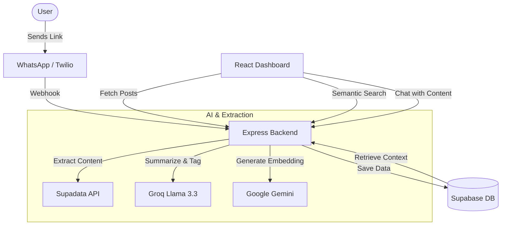

# SocialSynapse

SocialSynapse is an AI-powered "second brain" that allows you to save, organize, and chat with content from social media platforms (YouTube, Instagram, TikTok, etc.) via WhatsApp. It extracts content from links, generates AI summaries/categories, and provides a beautiful dashboard for searching and interacting with your saved knowledge.

Demo link - https://youtu.be/-PNwTyVJPgU

## Features

- **WhatsApp Integration**: Save content by simply sending a social media link to a WhatsApp bot.
- **AI-Powered Extraction**: Automatically extracts titles, descriptions, and transcripts (for videos).
- **Intelligent Summarization**: Uses Groq (Llama 3) to generate concise summaries and categorize content.
- **Semantic Search**: Find your saved posts using natural language queries powered by Gemini embeddings.
- **AI Chat**: Interact with your saved knowledge through a dedicated chat interface.
- **Insights & Stats**: Visualize your content distribution across platforms and categories.
- **Weekly Digest**: Get an AI-generated summary of your weekly saves.

## Tech Stack

### Backend
- **Node.js & Express**: Core API server.
- **Groq SDK (Llama 3.3)**: For summaries, categorization, and chat logic.
- **Google Generative AI (Gemini)**: For generating text embeddings.
- **Supadata**: For web scraping and content extraction.
- **Twilio**: For WhatsApp messaging integration.
- **Supabase**: PostgreSQL database with pgvector for semantic search.

### Frontend
- **React (Vite)**: Modern, responsive user interface.
- **Tailwind CSS**: Utility-first styling with a premium dark-mode aesthetic.
- **React Icons**: For visual elements.

## System Design



## Setup Instructions

### Prerequisites

You will need the following API keys:
- **Twilio**: Account SID, Auth Token, and a WhatsApp Sandbox number.
- **Supadata**: API key for content extraction.
- **Supabase**: Project URL and Service Role/Anon Key.
- **Google Gemini**: API key for embeddings.
- **Groq**: API key for LLM processing.

### Database Setup

1. Create a table in Supabase called `saved_posts`:
   ```sql
   create table saved_posts (
     id uuid primary key default uuid_generate_v4(),
     url text unique not null,
     platform text,
     title text,
     description text,
     transcript text,
     ai_summary text,
     ai_category text,
     embedding vector(768),
     saved_at timestamp with time zone default now()
   );
   ```
2. Create the `match_posts` function for semantic search:
   ```sql
   create or replace function match_posts (
     query_embedding vector(768),
     match_count int
   ) returns table (
     id uuid,
     url text,
     platform text,
     title text,
     ai_summary text,
     description text,
     similarity float
   )
   language plpgsql
   as $$
   begin
     return query
     select
       saved_posts.id,
       saved_posts.url,
       saved_posts.platform,
       saved_posts.title,
       saved_posts.ai_summary,
       saved_posts.description,
       1 - (saved_posts.embedding <=> query_embedding) as similarity
     from saved_posts
     order by saved_posts.embedding <=> query_embedding
     limit match_count;
   end;
   $$;
   ```

### Backend Installation

1. Navigate to the `backend` directory.
2. Install dependencies: `npm install`
3. Create a `.env` file based on the prerequisites:
   ```env
   TWILIO_ACCOUNT_SID=...
   TWILIO_AUTH_TOKEN=...
   TWILIO_WHATSAPP_NUMBER=...
   SUPADATA_API_KEY=...
   SUPABASE_URL=...
   SUPABASE_KEY=...
   GEMINI_API_KEY=...
   GROQ_API_KEY=...
   PORT=3000
   ```
4. Start the server: `node/nodemon server.js`

### Frontend Installation

1. Navigate to the `frontend` directory.
2. Install dependencies: `npm install`
3. Start the Vite development server: `npm run dev`

## Usage

1. **Saving Content**: Message your Twilio WhatsApp number with a link. The bot will extract and save it.
2. **Dashboard**: Open the frontend URL (usually `http://localhost:5173`) to view your saved posts.
3. **Search**: Use the search bar for keyword search or semantic search (using the AI icon).
4. **Chat**: Click on "Chat" in the sidebar to ask questions about your saved content.
